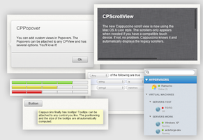
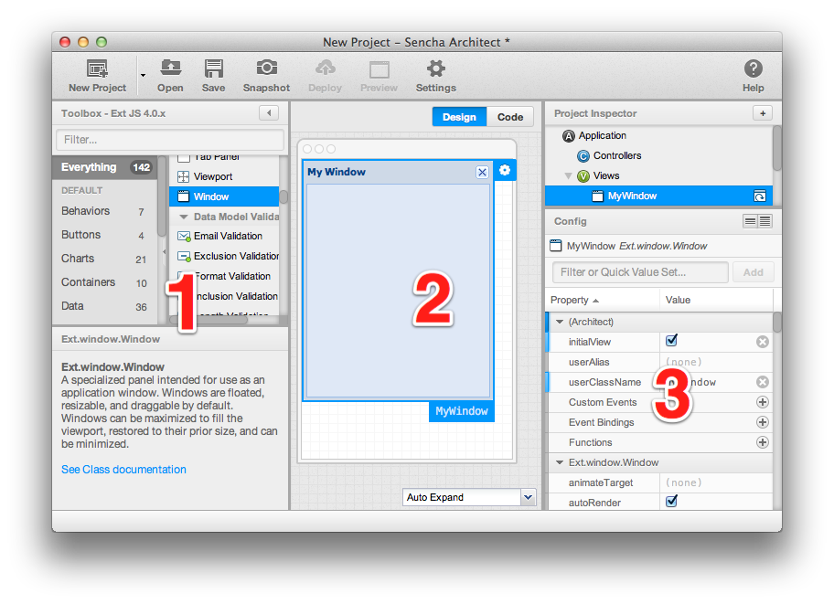
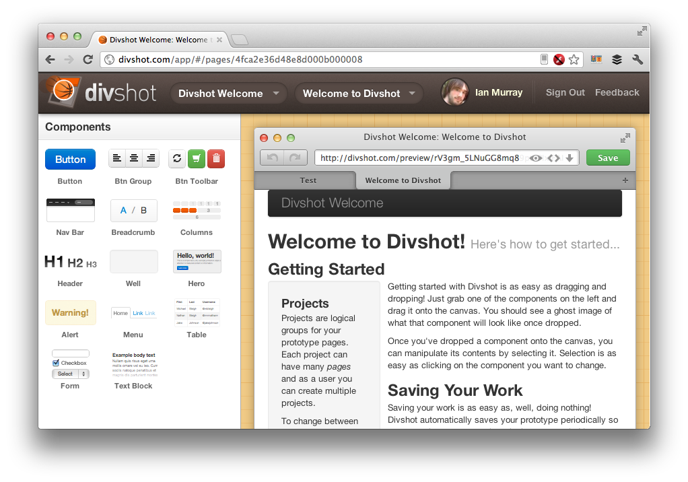
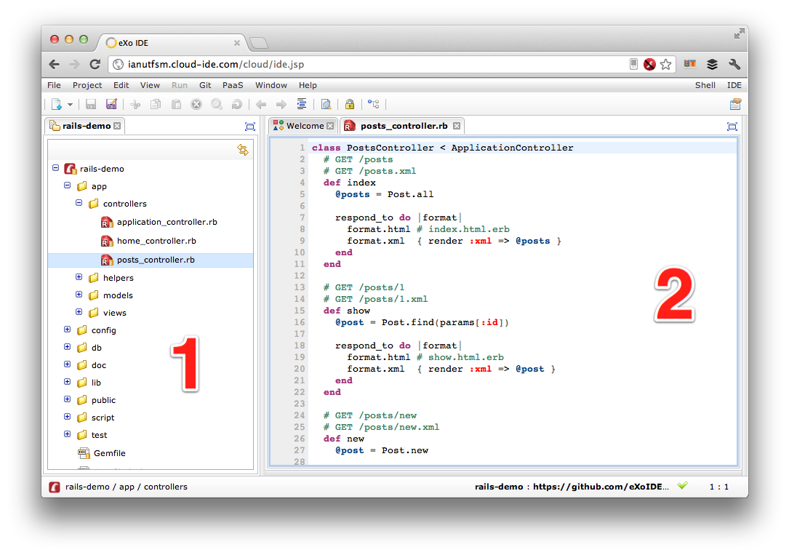
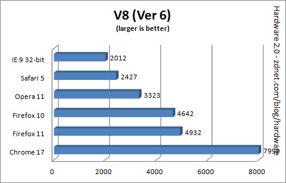
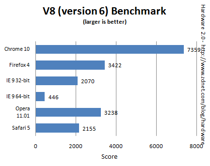

# Estado del Arte

La metodología para el desarrollo de aplicaciones web está cambiando. Ha pasado de estar enfocada casi completamente de desarrollar de lado de servidor, a desarrollar parcial o totalmente de lado de cliente. Frameworks como Backbone han revolucionado lo que se piensa sobre desarrollar aplicaciones completamente usando Javascript, y la aparición de muchísimos frameworks nuevos en este joven sub-mundo de aplicaciones muestra claramente una tendencia hacia este "paradigma".

Ahora bien, el hecho de que periódicamente aparezcan nuevos frameworks no es necesariamente bueno. Es fácil perderse, no se puede saber por dónde empezar, y lo peor de todo, cada framework hace lo suyo de formas diferentes, incluso utilizando paradigmas de desarrollo distintos (ya sea MVC [@mvc], MVP [@mvp] u otro de los que normalmente se utilizan).

En este capítulo, se revisarán las diferentes herramientas que existen en el mundo del desarrollo de aplicaciones Javascript, además de programas y utilidades que funcionan de manera similar a lo que se quiere lograr con Switch IDE y que están actualmente en el mercado. Se revisarán primero diferentes frameworks disponibles hoy en día, analizando sus ventajas y desventajas, para luego mostrar herramientas que facilitan el uso de frameworks y otro tipo de soluciones online.

## Frameworks Actuales

Existe una variedad enorme de frameworks para desarrollo web de lado de cliente, y, como se dijo anteriormente, día a día aparecen nuevos competidores, lo que pasó de ser algo bueno a algo que aumenta las barreras de entrada. El hecho de que haya tantas opciones para desarrolladores (incluso experimentados) hace que elegir uno sea muy difícil y que finalmente se opte por la solución incorrecta. Muchos frameworks tienen varios puntos fuertes, y no siempre un framework es la mejor solución para un tipo determinado de problema.

Ahora bien, sí existen buenos frameworks y varios de ellos son relativamente fáciles de entender y dominar. La mayoría de ellos llevan buen tiempo en el mercado y por ende tienen una comunidad fuerte y activa, junto con una base de código robusta.

### Backbone

[Backbone][backbone] [@backbone] es uno de los frameworks más populares. Basta con ver la gran cantidad de sitios que lo utilizan actualmente [@projects-backbone]. Es simple, extensible y muy poderoso, lo que lo hace una muy buena opción para desarrollar aplicaciones responsivas. Además, sus pocas dependencias hacen que las aplicaciones desarrolladas con él sean livianas.

El objetivo principal de Backbone es facilitar y dar estructura a aplicaciones que se basan fuertemente en funcionar del lado del cliente (es decir, en el navegador mismo). Normalmente, escribir aplicaciones de este estilo es posible utilizando sólo Javascript y sin usar algún framework, pero ello resulta tedioso, y lleva a aplicaciones difíciles de mantener. Backbone (y la mayoría de los frameworks que se nombrarán en este capítulo) intentan evitar esto último dándole una estructura a las aplicaciones, separando vistas de controladores y modelos, y dejando las cosas en su lugar. Trae consigo facilidades para guardar información en servidores (en cierta forma proveyendo un "backend" a las aplicaciones que se creen). Además, facilitan la interacción con el usuario, a la larga ahorrando tiempo al desarrollador. 

Es utilizado por un sinfín de proyectos, algunos muy populares, tales como [Groupon Now!](http://www.groupon.com/now), [Trello](http://trello.com), entre otros [@projects-backbone]. Las aplicaciones nombradas no son proyectos pequeños y simples, sino que son aplicaciones muy poderosas que se benfician muy bien de lo que Backbone provee.

### Cappuccino

[Cappuccino][cappuccino-project] [@cappuccino] es un framework de desarrollo web enfocado en llevar "Cocoa" de Apple a la web, aunque no está en forma alguna afiliado con esta empresa. Abstrae completamente el desarrollo web a un único lenguaje: Objective-J, un superconjunto de Javascript (de la misma forma que Objective-C es un superconjunto de C). No cuenta con demasiados adeptos, dado que no muchos sitios lo utilizan, pero el framework sigue en constante desarrollo, aunque con una comunidad menor que la de Backbone, eso sí.

Las ventajas de este framework son varias. Al estar imitando bastante fuertemente a Apple, sigue varios estándares ya conocidos, y lo hace bastante fácil de aprender para una persona con experiencia en desarrollo iOS o Mac OS X. Además, todo se desarrolla con el mismo lenguaje, y trae integrados varios controles (botones, tablas, ventanas, menús), lo que le permite al desarrollador enfocarse sólo en código y no en el diseño (ver Figura \ref{figure:cappuccino}). A diferencia de Backbone, en donde el desarrollador debe trabajar por un lado con el código y por otro con el diseño y los estilos de las aplicaciones, Cappuccino trae todo eso en un solo framework, de la misma forma que Visual C# trae sus controles y el diseño incorporados, por ejemplo.

Una de las características interesantes de este framework (aunque no es la que más se publicita), es la capacidad de usar el constructor de interfaces de [Xcode][xcode] [@xcode] — Interface Builder — para crear las interfaces. Eso sí, no todos los componentes que están disponibles en Xcode están implementados en Cappuccino, y agregar elementos inexistentes no siempre arroja errores fáciles de descubrir. Además, desarrollar usando esta técnica, requiere instalar varios componentes (entre ellos, Xcode, que no es liviano) y se necesita un computador Mac, dado que Xcode no funciona en otras plataformas. Por si eso no fuera poco, el ir y venir entre Xcode y el editor que se use para Cappuccino hace que la experiencia sea todo menos placentera para el desarrollador.

Además de lo anterior, tiene otras desventajas. Por un lado, es necesario aprender un lenguaje nuevo (Objective-J) y utilizar un framework completamente distinto a todos los conocidos (casi todos están programados en Javascript directamente). Por otro lado, hay varios controles esenciales que no están implementados, como por ejemplo, un control de entrada de texto multilínea no está soportado actualmente por el framework (aunque existen herramientas de terceros). 

### Ext JS

[Ext JS][extjs] [@extjs] es un framework con bastante tiempo en el mercado. Tiene soporte para una gran variedad de componentes y es muy poderoso. Una de las ventajas importantes de este framework, es que existe una empresa bastante importante detrás: [Sencha Inc][sencha]. Esto asegura que el framework tiene soporte detrás, y que existe mucha gente preocupada constantemente de su desarrollo. Incluso, esta empresa ofrece soporte técnico pagado para este framework.

Este es un framework bastante poderoso, a la par e incluso por sobre Cappucino y otros similares. Al llevar bastante tiempo circulando (desde el 2007 [@ext-releases]), es un framework con una gran cantidad de componentes y características disponibles que lo hacen muy poderoso. Se diferencia en casi las mismas cosas con Backbone que Cappuccino, al tener integrados muchísimos componentes como botones, tablas, ventanas, entre otros, pero con la diferencia de que este framework sí está escrito en Javascript directamente, por lo que no hace falta aprender un lenguaje nuevo.

Ahora bien, tiene sus desventajas. Es un framework muy completo y dominarlo toma más tiempo que otros. No es un framework fácil de usar y no existe una gran comunidad detrás (no existen muchos sitios desarrollados con esta plataforma, al menos no sitios públicos), por lo que encontrar tutoriales e información al respecto no es tarea fácil. Además, una de las mayores desventajas, es que este framework no es gratuito para desarrollo comercial. Si se desea desarrollar una aplicación web y mantener el código propietario, se deben cancelar (por lo bajo) $329 dólares americanos [@buy-ext], valor a veces prohibitivo considerando que la mayoría de los otros frameworks son gratuitos.

<!-- ------------------------------------------------------------------------- -->

## Herramientas Actuales

Ahora que se han visto una variedad de frameworks disponibles para desarrollar aplicaciones web, se procederá a analizar el mundo de las herramientas para el desarrollo de éstas. El enfoque de esta sección es analizar diferentes programas y servicios que se ofrecen, que son en alguna forma similares a lo que se quiere lograr con Switch IDE.

### Sencha Architect

Si se tuviera que elegir una herramienta para describir lo que se quiere lograr con Switch, sería [Sencha Architect][sencha-architect] [@sencha-architect].  Sencha Architect es una herramienta de los mismos creadores del framework Ext JS, y es lo que más se asemeja a lo que se quiere lograr con esta memoria. Es bastante poderosa, y permite desarrollar aplicaciones web y móviles (basadas en web, no nativas) de manera visual, de una forma bastante similar a lo que se quiere lograr con Switch IDE.

Sencha Architect es la herramienta que más se asemeja a un IDE para desarrollo de aplicaciones nativas (como Xcode o Microsoft Visual Studio). Posee una barra lateral con componentes (ver Figura \ref{figure:sencha-architect}, el número 1), un área central de trabajo (número 2) y propiedades de los diferentes componentes que existan en el área de trabajo (número 3).

Las ventajas de esta herramienta son claras: es posible crear las vistas de las aplicaciones directamente, arrastrando componentes. De la misma forma que herramientas para desarrollo nativo, esto ahorra tiempo al momento de desarrollar. 

Las desventajas son varias, eso sí. Por un lado, el desarrollador está obligado a trabajar con Ext JS como framework (que, como ya se dijo antes, no es fácil de aprender y usar), y por otro lado, la licencia de uso de este software no deja de ser considerable: $399 dólares americanos [@buy-sencha-architect] al momento de escribir este documento. Esto es un monto realmente alto, pues si se compara esto con el precio de un editor de código relativamente bueno (como lo son TextMate o Sublime Text 2, ambos cercanos a los $50 dólares), es una inversión de consideración. Además, a ese valor hay que agregarle otros $329 por la licencia de uso de Ext JS [@buy-ext], si es que se quiere para uso comercial.

### Divshot

[Divshot][divshot] [@divshot] es una de las herramientas que inspiró la presente memoria. Es una aplicación de prototipado rápido basado en web. Fue creada en abril de 2012, por lo que es una herramienta relativamente nueva y, de hecho, no está abierta al público aún. Se logró conseguir una licencia de uso en esta fase para poder estudiar el poder de esta herramienta, y se llegó a la conclusión de que realmente tiene mucho potencial.

Permite, utilizando Twitter Bootstrap [@bootstrap], crear prototipos de sitios y aplicaciones web arrastrando componentes, de la misma forma que IDEs como Xcode o Microsoft Visual Studio. En la presente memoria, se quiere lograr un comportamiento muy parecido para la creación de vistas, por lo que se podría considerar que Divshot es una de las inspiraciones más grandes para esta memoria.

Entre las ventajas que presenta la herramienta, está la facilidad con la que se pueden crear prototipos de vistas. Sólo arrastrando componentes, se puede llegar a una vista en pocos minutos. Además, es posible previsualizar los resultados fácilmente, e incluso exportar a HTML ^[**Hypertext Markup Language:** es el lenguaje de etiquetas utilizado para las páginas web. Todas ellas están hechas con esto, más una combinación de otros lenguajes. [@html]] con un sólo click. Lo mejor de todo, es que el HTML generado está muy bien ordenado y formateado.

Desventajas no tiene muchas. Es una herramienta muy puntual y bien diseñada, y, como aún está en fases de desarrollo, en constante mejora. Ahora bien, no es un "competidor" directo de Switch IDE, dado que no es una herramienta para programar. Simplemente permite crear vistas, que es sólo un componente de Switch.

### eXo Cloud IDE

[eXo Cloud IDE][exo-ide] [@exo-ide] es un entorno de desarrollo integrado, en la nube. Tiene varias características que lo hacen una buena opción al momento de querer colaborar o mantener el código alojado en internet. Soporta una gran variedad de lenguajes (entre ellos Java, Ruby y Python) y frameworks (como Ruby on Rails, Spring o incluso Google App Engine).

Además de lo anterior, soporta plataformas como Heroku para subir cambios a servidores directo desde el navegador, e incluso tiene soporte para versionamiento con Git [@git].

Como cualquier IDE nativa estilo Xcode o Microsoft Visual Studio, tiene un visor de los archivos actualmente abiertos (ver Figura \ref{figure:exo-ide}, número 1) y el editor de código mismo (número 2). 

Las ventajas que provee esta herramienta son el no tener que depender de un sólo equipo para desarrollar. Al mantener el código en la nube, sólo es necesario conectarse al sitio web y empezar a trabajar. Por esto último, tampoco es necesario instalar las diferentes herramientas necesarias para desarrollar (como puede ser instalar Ruby o Python, que a veces es engorroso).

Ahora bien, tiene sus desventajas, siendo la más importante el hecho de que no permite desarrollar vistas de forma visual (que es lo que uno espera de una herramienta integrada de este estilo). Además, al no estar enfocado en un framework de desarrollo específico, no es muy poderoso al momento de elegir alguno (en términos de autocompletado de código por ejemplo). Relacionado con esto último, no permite desarrollar aplicaciones de lado de cliente, sólo de lado de servidor, por lo que también está limitado por ese lado. Además, desarrollar aplicaciones con los frameworks que soporta por lo general implica utilizar mucho el terminal de comandos para realizar pruebas, y en un ambiente web, eso no es fácilmente replicable.

### Wavemaker

[Wavemaker][wavemaker] [@wavemaker] es una herramienta que permite generar "bases de datos" de manera visual. El objetivo principal de esta aplicación es poder crear sistemas de manejo de datos de manera fácil, escribiendo la menor cantidad de código posible.

Esta herramienta se asemeja más a lo que es Microsoft Access. La idea es poder crear interfaces para guardar y organizar información rápidamente y sin programar. Es una aplicación enfocada más a gente que no tiene conocimientos de programación, aunque según los creadores de Wavemaker, las aplicaciones que se generan son aplicaciones Java completas, que pueden ser extendidas más adelante programando Java directamente.

Las ventajas dependen realmente de lo que se quiera hacer con la herramienta. Si el usuario no tiene conocimientos en el área de desarrollo de software, entonces la herramienta es bastante útil, aunque los resultados no son muy complejos. Por otro lado, si se le mira desde el punto de vista de un desarrollador, la herramienta no ofrece mayores beneficios a las anteriormente mencionadas.

### Zoho Creator

[Zoho Creator][zoho-creator] [@zoho-creator] es un servicio web que tiene más o menos el mismo enfoque que Wavemaker: crear bases de datos simples sin programar. Ahora bien, se diferencia un poco con Wavemaker en el sentido de que es un servicio, pagado, que permite crear aplicaciones en la nube y mantenerlas ahí, mientras que la herramienta anterior permite crearlas y exportarlas, para luego incluso extenderlas si es que se tienen conocimientos.

Si bien Zoho Creator es una herramienta relativamente poderosa y fácil de usar, no es una herramienta que utilizaría un desarrollador. Hay varias razones para esto último. Primero, no permite exportar lo creado para alojarlo en otro servidor; segundo, no es una herramienta de desarrollo que permita crear aplicaciones de lado de cliente o de servidor, sino que permite crear simples bases de datos; y tercero, no es una herramienta gratuita o de código abierto, lo que hace que lo creado con ella tenga ciertas limitaciones en cuanto a licencias.

<!--
# Motores Javascript

La parte más importante de un navegador hoy en día es quizás su motor Javascript. Dada la popularidad de sitios que dependen fuertemente de este lenguaje, el intérprete que contenga cada navegador influye fuertemente en su desempeño. Le sigue (o tal vez adelanta) en importancia qué tan bien un navegador se adhiere al estándar HTML5.

Un navegador con un motor de Javascript mediocre, hará que la experiencia para el usuario al navegar sea desastrosa. La web cuenta con innumerables sitios que utilizan fuertemente animaciones, manipulación del DOM[^dom] y conexiones por AJAX[^ajax], por lo que un motor con mal desempeño ralentizará el navegador completo y hará los sitios (y aplicaciones) web inutilizables.

Afortunadamente, dada la creciente popularidad y uso de frameworks Javascript, la gente detrás de los navegadores más populares compite constantemente para crear motores más eficientes y rápidos. Muchos, incluso, sacan provecho de procesadores multi-núcleo y de las tarjetas de video para mejorar su rendimiento.

Actualmente, existen 4 competidores principales en el mundo de los navegadores web:

  - Chrome
  - Firefox
  - Internet Explorer
  - Safari

Chrome y Safari usan el mismo motor para interpretar HTML y CSS[^css], llamado WebKit, mientras que Firefox utiliza Gecko. Internet Explorer utiliza su propio motor. Ahora bien, aunque Chrome y Safari compartan el mismo motor de rederizado, ninguno de los 4 navegadores utiliza el mismo motor de Javascript.

Chrome — V8

:    Chrome utiliza *V8*, un motor creado por Google, cuya principal característica es que compila Javascript a lenguaje de máquina antes de ejecutarlo. Utiliza además técnicas de optimización con caching, entre otras.

Firefox — SpiderMonkey

:    Firefox utiliza hace muchísimo tiempo *SpiderMonkey*. Es el primer motor de Javascript que existió, creado en Netscape y ahora mantenido por la fundación Mozilla. Utiliza técnicas de JIT[^jit], además de usar decompiladores y recolectores de basura.

Internet Explorer 9 — Chakra

:    *Chakra* es el motor que alimenta a Internet Explorer 9. Sus principales características es que utiliza técnicas de JIT, pero en un núcleo aparte, además de utilizar fuertemente tarjetas de video para optmitizar renderizado 3D y video.

Safari — SquirrelFish

:    Safari utiliza un motor llamado *SquirrelFish*, hoy en día evolucionado a SquirrelFish Extreme (SFX), y se publicita como "Nitro". Utiliza una técnica similar a V8, compilando Javascript a lenguaje de máquina.

### Rendimiento

Dada la creciente fiebre de hacer motores cada vez más rápidos, se han creado numerosas pruebas para medir el rendimiento de los motores Javascript. Entre ellos: *V8*, llamado igual que su motor de pruebas, creado por Google; *SunSpider*, creado por Mozilla; *PeaceKeeper*, creado por FutureMark; y *Kraken*, también creado por Mozilla.

La revista ZDNet publicó no hace mucho un artículo^[**The BIG browser benchmark: Chrome 17 vs Opera 11 vs Firefox 11 vs IE9 vs Safari 5:** Artículo disponible en <http://www.zdnet.com/blog/hardware/the-big-browser-benchmark-chrome-17-vs-opera-11-vs-firefox-11-vs-ie9-vs-safari-5/19079>.]  comparando los diferentes motores utilizando estas diferentes pruebas. Compararon Internet Explorer 9, Chrome 17, Firefox 11 (y 10), Safari 5 e incluso Opera 11. Esto lo llevan haciendo periódicamente hace tiempo, comparando diferentes navegadores con diferentes pruebas.

En las Figuras \ref{figures:v8} y \ref{figures:v8-old} se muestran los resultados de las pruebas utilizando V8 (las pruebas, no el motor). Se aprecia claramente que el performance de los navegadores más populares ha avanzado bastante en tan sólo un año, y ha sido así hace tiempo. Con la ploriferación de procesadores más poderosos y el aprovechamiento de las tecnologías de multi-núcleo y de las tarjetas de video.

-->

<!-- LINKS -->

[extjs]: http://www.sencha.com/products/extjs/
[sencha]: http://www.sencha.com/
[sencha-architect]: http://www.sencha.com/products/architect
[cappuccino-project]: http://cappuccino-project.org
[backbone]: http://backbonejs.org
[exo-ide]: http://cloud-ide.com
[xcode]: https://developer.apple.com/xcode/
[wavemaker]: http://www.wavemaker.com/
[zoho-creator]: http://www.zoho.com/creator/
[divshot]: http://divshot.com/
[twitter-bootstrap]: http://getbootstrap.com

<!-- FOOTNOTES -->

[^mvc]: **Model-View-Controler:** Paradigma muy utilizado hoy en día por frameworks en toda clase de plataformas, desde servidores hasta en la plataforma de desarrollo para iOS de Apple. Originalmente pensado para Smalltalk.
[^mvvm]: **Model-View-ViewModel:** paradigma ligeramente distinto a MVC, que está ganando adeptos en el mundo del desarrollo de lado de cliente
[^mvp]: **Model-View-Presenter:** abstrae el controlador a un "presentador"
[^dom]: **Document Object Model:** es la representación e interface que se le da a los diferentes objetos presentes al generar la vista de una página web. "Manipular el DOM" normalmente se refiere a manipular el contenido del documento (sitio web en este caso) en tiempo real. — "Document Object Model (DOM)", W3C, <http://www.w3.org/DOM/>, visitado el 09-07-2012.
[^ajax]: **Asynchronous Javascript And XML:** es una técnica de comunicación a través de Javascript que utilizan muchos desarrolladores para transferir datos de forma asíncrona (es decir, sin que el cliente lo note, en segundo plano). Inicialmente la técnica utilizó fuertemente la idea de transferir XML (de ahí el nombre), para hoy en día transferir más fuertemente Javascript Object Notation (JSON) o HTML plano. El término fue acuñado por primera vez el 2005 por Jesse James Garrett. — "Ajax: A New Approach to Web Applications", Jesse James Garrett, <http://www.adaptivepath.com/ideas/ajax-new-approach-web-applications>, visitado el 09-07-2012.
[^css]: **Cascading Style Sheets:** son las llamadas "hojas de estilo" utilizadas para dar, valga la redundancia, estilo a los sitios. HTML sólo da estructura, mientras que CSS es lo que da colores, bordes, ajusta las posiciones de los diferentes elementos, etc.
[^jit]: **Just In Time:** es una técnica de compilación en la que el lenguaje se compila a lenguaje de máquina en tiempo de ejecución.

