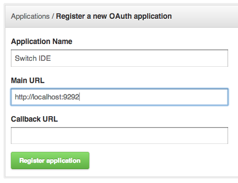

# Construcción de la Solución

Este capítulo tiene por objetivo detallar todo el proceso del diseño y desarrollo de la solución propuesta anteriormente. Se dividirá en los siguientes subcapítulos:

  a. Diseño de la solución: se explicará cómo ambas componentes (frontend y backend) interactuarán entre sí. Además, se describirá cómo funcionarán ambas partes en términos de manipulación de archivos y el proyecto completo. Por último, se explicará cómo se diseñó el componente principal de la solución (el editor de interfaces).
  b. Primera etapa de construcción: el desarrollo de la solución se dividió en dos etapas. Primero, se desarrolló lo que se consideró una "base" del programa. Esta etapa contempló el desarrollo de gran parte del backend y, en el frontend, una herramienta que permitiera crear proyectos nuevos, crear, editar y eliminar archivos, compilar y correr el proyecto. 
  c. Segunda etapa de construcción: la segunda parte del desarrollo se enfocó en desarrollar y perfeccionar el editor de interfaces. Dado que este componente es la parte más importante de la solución, se decidió dedicar una etapa completa a él.

## Diseño de la Solución

### Backend

La solución es una aplicación mayoritariamente de lado de cliente, por lo que la mayor cantidad de lógica debe ir en este lado. Por esta razón, se diseñó el servidor de la forma más simple posible. Las tareas principales que tiene el servidor o backend de la aplicación son:

  - Autentificar usuarios
  - Generar proyectos utilizando Brunch
  - Manipular los archivos. Esto incluye crear, eliminar, renombrar y actualizar archivos (o sea, recibir el contenido de ellos y guardarlo a disco)
  - Ensamblar el proyecto
  - Levantar un servidor estático que permita al usuario probar su proyecto

Algunas de estas tareas son realizadas por la utilidad Brunch, por lo que sólo es necesario hacer que el servidor ejecute un comando en la consola para llevarlas a cabo. El resto de las tareas son básicamente manipulación de archivos, para lo cual cualquier lenguaje de programación trae funciones o librerías (y Ruby no es ninguna excepción).

Se decidió utilizar una aproximación a lo que es REST^[explicar esto] para los servicios que proveerá el backend. En REST, la idea es representar objetos, y exponer diferentes métodos para tales objetos. En este caso, se decidió que deben existir 3 objetos diferentes: usuarios, proyectos y archivos. 

  - Usuarios: dado que la idea es que varios usuarios puedan utilizar el sistema a la vez, debe existir esta entidad en el servidor (y por ende en la base de datos).
  - Proyectos: es casi la base de todo. Cada proyecto contendrá los diferentes archivos y carpetas, y pertenecerá a un usuario.
  - Archivos: esto se refiere a archivos y carpetas. Por la forma en la que se manipulan los archivos en el servidor y en el cliente, es más conveniente manejarlos de (casi) la misma forma. Esto último se refiere a la forma en la que se obtienen los archivos en el servidor, y las acciones que se realizan en ellos. Ambos archivos y carpetas se crean y eliminan, como también se renombran. La única diferencia substancial es que las carpetas no tienen contenido y no se actualizan como el resto de los archivos.

El servidor autentificará a los usuarios utilizando sus cuentas de GitHub y OAuth. OAuth es un protocolo de autentificación y autorización que permite al usuario registrarse e ingresar a la aplicación con un sólo click  (dos si ingresa por primera vez). Dado que esta es una herramienta enfocada a programadores, y considerando que GitHub es una plataforma conocida por cualquier desarrollador que se mantenga al día, utilizar este sistema para autentificar a los usuarios es simple y conveniente. Por el lado de servidor, basta con incluir una librería que redirige a los usuarios a las URLs específicas y crear un registro en la base de datos si es que el usuario está ingresando por primera vez.

### Frontend

El frontend tendrá dos tareas principalmente. Primero, deberá permitir a los usuarios autentificarse. Para esto, y para efectos del presente trabajo, será una simple página web que redirija al usuario a GitHub para autentificarse usando este sistema. Segundo, deberá proveer al usuario con la IDE que se quiere construir en este documento.

***EXPLICAR DE QUÉ TRATA LA PÁGINA DE AUTENTIFICACIÓN A GRANDES RASGOS, SCREENSHOTS Y TODO***

La IDE misma se dividirá en tres componentes principales: la barra lateral izquierda para explorar los archivos del proyecto, la barra lateral derecha con componentes visuales (como botones, formularios, etc.), y la sección central que contendrá el código del archivo actualmente seleccionado o la vista previa en caso de estar editando una vista.

Contará además con una barra superior con un menú (al igual que cualquier aplicación de escritorio), pero dado que proveerá simples accesos directos a funciones que se explicarán más adelante no se detallará su diseño ni implementación.

#### Definición de Objetos
\label{section:object-definition}

En esta sección se pretende explicar qué objetos existirán en el frontend, sus responsabilidades y cómo interactuarán entre ellos. Primero se definirán algunos conceptos necesarios para entender de qué tipos de objetos se estará hablando.

Modelo
  ~ Representa un objeto en un proyecto, como por ejemplo un archivo, una carpeta o el proyecto mismo. Cada modelo es responsable de persistir su estado de alguna forma (comunicándose con un servidor o almacenando datos en el mismo navegador).
  
Colección
  ~ Es básicamente una lista de instancias de un tipo de modelo. Por ejemplo, una carpeta podría considerarse una colección de archivos (siendo cada archivo una instancia de un modelo).
  
Vista
  ~ Una vista en Backbone es un archivo que se encarga de presentar información al usuario, y además de interactuar con él, por ejemplo ejecutando funciones cuando se haga un click en un botón. Una vista por lo general presenta un modelo (o una colección). Por ejemplo, se puede tener una vista para cada instancia de un archivo, o bien se pueden tener vistas que no presenten a ningún modelo en particular.
  
Template
  ~ Un template es un trozo de HTML que una vista utiliza para generar lo que el usuario ve. Si bien no son enteramente necesarias y una vista podría generar todo lo que necesita con Javascript, hacen la tarea algo más fácil. Contrario a lo que pueda suponerse, el editor visual en el que se trabajará en este documento editará los templates, y no las vistas. 

##### Modelos y Colecciones

A continuación se explicará a grandes rasgos los modelos y colecciones que existirán en el frontend. Se tendrán modelos para los proyectos y los archivos. Cada uno se encargará de comunicarse con el backend para obtener los datos que le sean necesarios o bien para guardar los cambios. 

El modelo de proyecto
  ~ Guardará el nombre de éste y una referencia a una colección de los archivos que se encuentren en la raíz de su carpeta. Tendrá como responsabilidades crear archivos y carpetas, ensamblar el proyecto e iniciar el servidor de pruebas. Estas acciones se complementan con llamadas al backend que realizan las tareas mismas.

El modelo de archivo
  ~ Se encargará de guardar el nombre y el contenido (en caso de que corresponda) del archivo o carpeta al que representa, además de guardar una referencia al proyecto al que pertenece y . Tendrá como responabilidades pedir su contenido, actualizarlo, renombrar y eliminar el archivo del sistema. Todas estas acciones se complementan además con llamadas al backend.

La colección de archivos
  ~ Tendrá como responsabilidad ordenar las listas de archivos una vez que la haya obtenido (además de guardar una referencia a cada modelo de archivo que le corresponda). Ordenar las listas de archios es importante pues el backend arroja una lista de archivos ordenada alfabéticamente, pero, dado que archivos y directorios son considerados de la misma forma en el backend, es necesario ordenar la lista de manera que los directorios queden arriba. Esto facilita encontrar archivos para el usuario.

##### Vistas

Cada una de las siguientes vistas considera un template asociado.

Explorador de Archivos
  ~ se colocará en la barra lateral izquierda, y tendrá dos listas de archivos. Una lista de archivos actualmente abiertos y la lista de archivos y directorios en el proyecto. Tendrá entre sus responsabilidades mantener una lista de archivos que se encuentran actualmente abiertos para que el usuario pueda navegar entre ellos.

Archivo
  ~ Esta vista representará a un archivo en la vista anterior (exporador de archivos). Mostrará su nombre y un icono que represente si es un directorio, un archivo o una vista editable con el editor que se construirá. Entre sus responsabilidades están abrir los archivos (o sea, abrir el archivo en el editor de código o en el editor de vistas en caso que corresponda), embeber listas de archivos en caso de que se clickee un directorio y permitir al usuario renombrar archivos, mostrando un menú contextual.

Editor de Texto
  ~ Esta vista contendrá el editor de archivos de texto (editor de código). Sus responsabilidades serán mostrar un editor con resaltado de sintaxis y modificar el modelo de archivo que corresponda para guardar cambios.

Editor de Vistas
  ~ esta vista mostrará templates y, en una barra lateral derecha, diferentes componentes para que el usuario los arrastre y agregue. Contará además con un editor de código HTML, en caso de que el usuario quiera editar la vista o realizar cambios que el editor no permita directamente. Tiene las mismas responsabilidades que el editor de texto.
  
#### Diseño del Editor de Templates

El editor de interfaces se construirá de manera que el usuario pueda arrastar componentes como botones o campos de texto directamente en una vista previa del template que esté editando. El contenido de los archivos de templates es simplemente HTML, por lo que es posible presentarlos directamente en la aplicación. Este contenedor o vista previa del template se le llamará "canvas" de ahora en adelante.

El objetivo es que el usuario arrastre elementos hacia el canvas de la misma forma en la que se hace en Xcode o Visual Studio. El sistema debe proveerle retroalimentación visual mostrando el objeto que está arrastrando y además mostrar en qué lugar quedararía el elemento una vez que el usuario lo suelte.

Para implementar este concepto de arrastrar y soltar, se utilizará jQuery UI. esta librería provee, entre otras cosas, métodos para habilitar el arrastrado de elementos en una página. El usuario arrastrará un elemento, y, mediante las llamadas de jQuery, se colocará el elemento en donde el usuario tenga su cursor en el momento, a manera de proveer retroalimentación visual. En cuanto el usuario suelte el elemento, se agregará su correspondiente fragmento de HTML en el template, lo que se reflejará en el canvas en tiempo real.


En la Figura \ref{figures:drag-editor} se pueden apreciar los diferentes elementos de retroalimentación al momento de arrastrar un elemento. En el punto 1 se pueden apreciar, primero, un borde amarillo al rededor del elemento en donde "caería" el componente. Además, en el mismo número, puede visualizarse cómo se vería el componente (en este caso un botón) una vez que el usuario lo deje ahí. En el número 2, puede verse el mismo componente, que sigue al cursor mientras el usuario esté arrastrando. Esto le muestra al usuario qué es lo que está arrastrando.

De esta forma, el desarrollador puede ver, por un lado, qué componente estaría agregando al canvas y, por otro lado, cómo quedaría éste una vez que lo agregue.


<!--
## Flujo del Usuario ("Casos de Uso")

A continuación se detallarán algunos de los casos de uso que tiene la aplicación.

### Caso de Uso: El usuario ingresa a la aplicación

### Caso de Uso: El usuario crea un proyecto nuevo

### Caso de Uso: El usuario abre un proyecto existente
-->


## Primera Etapa de Construcción

### Creación del Entorno de Trabajo

En esta sección se detallarán cómo se crearon y estructuraron los dos entornos de trabajo, tanto para el backend como para el frontend. 

Ambos entornos de trabajo se crearon en carpetas independientes (dada su naturaleza) y se inicializaron repositorios Git en cada una, a manera de mantener un control de versiones en cada una.

Para el control de versiones no se utilizó ninguna estrategia en especial. Dado que sólo el autor estará desarrollando, no valdría la pena implementar alguna estrategia de ramas o algo parecido para el control de versiones. Simplemente se utilizó la rama principal (`master` en Git), y se fueron creando "commits" cuando se considerara necesario.

#### Entorno de Trabajo para el Backend

El backend utilizará Ruby con Sinatra. Sinatra se diferencia de, por ejemplo, Rails, en que es un framework mucho más simple. Por esto, es que no posee utilidades para crear directorios de trabajo. La idea detrás de Sinatra es crear todo en un sólo archivo. Si bien esto es posible, e incluso aconsejable para algunas aplicaciones, no lo es para ésta, en donde se tendrán diferentes modelos y controladores. Por lo tanto se definió la siguiente estructura para el backend:

- `api`
    - `v1`
        - `config`: contiene diferentes archivos de configuración
        - `controllers`: los diferentes controladores
        - `models`: los modelos de usuario y proyecto 
        - `app.rb`: este archivo es la base de la aplicación Sinatra, pues nicializa ciertas configuraciones y contiene métodos compartidos por los controladores
        - `boot.rb`: este archivo es cargado inicialmente y se encarga de incluir las diferentes librerías y archivos para incializar el servidor
- `projects`: será el contenedor de los diferentes proyectos que crearán los usuarios
- `public`: esta carpeta sirve archivos estáticos directamente, como imágenes
- `Gemfile`: archivo utilizado por Bundler (una librería de Ruby) para definir qué librerías y en qué versiones utilizará el backend
- `config.ru`: archivo utilizado para levantar el servidor

Se decidió estructurar el backend en carpetas de versiones. La idea detrás de esto es poder dividir cada versión de la API de manera de no perder compatibilidad con posibles clientes que estén basados en una versión de la API. Por ejemplo, de llegar a crearse un cliente para tablets, cada cliente estaría atado a una versión específica. Si se cambiara algún método (o se descontinuara), el cliente automáticamente fallaría. En cambio, teniendo diferentes versiones, se puede mantener esta compatibilidad.

Se creó además una carpeta llamada `projects`. Esta carpeta (que no es accesible directamente), guarda cada uno de los proyectos de cada usuario. Cada vez que se inicialice uno nuevo, se creará una subcarpeta en este directorio con la estructura determinada.

El archivo `Gemfile` es un archivo que utiliza la librería Bundler^[citar blablabla]. Esta utilidad permite especificar librerías externas que se quieren incluir en un proyecto (en este caso el backend) y especificar sus versiones. Por ejemplo, un extracto de un archivo Gemfile podría verse así:

```ruby
gem 'sinatra', '1.3.3' # Especifica que se utilizará la versión 1.3.3

gem 'activerecord', '~> 3.2' # Especifica que se utilizarán 
                             # versiones 3.2.X

gem 'haml' # Especifica que se utilizará la última versión
```

La gran utilidad de esta herramienta es que, al momento de ejecutar en la consola `bundle install`, las versiones especificadas son descargadas y se crea un archivo llamado `Gemfile.lock` que guarda las versiones que están siendo utilizadas. De esta forma, cuando otro desarrollador descargue el repositorio y ejecute nuevamente `bundle install` para instalar las dependencias, se descargarán exactamente esas versiones y ambos desarrolladores tendrán el mismo entorno de desarrollo.

Finalmente, el archivo `config.ru` especifica cómo debe levantarse el servidor. Este archivo detalla diferentes rutas que deben ser "montadas" y a las cuales el servidor debe responder de diferentes maneras. En este caso, se tendrán dos rutas (incialmente). Una, en la que se montará el backend mismo, o sea, `/api/v1`, y la otra, en la que se montará un servidor estático que sirva los archivos en la carpeta `public`.

#### Entorno de Trabajo para el Frontend

De la misma forma en que Switch utilizará Brunch para crear y administrar proyectos, se decidió utilizar la misma solución para construir la IDE. Brunch utiliza un sistema de esqueletos ("skeletons", en inglés), los cuales utiliza para crear la estructura de los proyectos. Existe una gran variedad, utilizando diferentes lenguajes y frameworks. Se encontró uno que utiliza Backbone y CoffeeScript y se utilizó para crear la estructura de archivos inicial.

De no existir esta estructura, habría que escribir todo dentro de un sólo archivo, lo que para aplicaciones muy pequeñas puede ser práctico, pero no lo es en este caso. La estructura consiste en la siguiente:

- `app`
    + `assets`: imágenes y el archivo HTML principal de la aplicación
    + `models`: los modelos y colecciones
    + `routers`: definen los diferentes estados de la aplicación e inicializan lo necesario para funcionar en cada uno
    + `styles`: archivos de estilo (CSS) modularizados para cada sección de la aplicación
    + `views`: las vistas (o controladores)
        * `templates`: los archivos con HTML de cada vista
- `vendor`: librerías (Javascript o CSS) externas, como jQuery, Bootstrap, etc.

Existen otras carpetas que acá no se mencionan dado que no son relevantes a la aplicación. La funcionalidad de cada uno de estos tipos de archivos se explicaron en la Sección \ref{section:object-definition}.

Para crear el entorno de trabajo, simplemente se ejecuta el siguiente comando:

```sh
brunch new -s git://github.com/meleyal/brunch-crumbs.git
```

Este comando utiliza el esqueleto presente en [github.com/meleyal/brunch-crumbs](https://github.com/meleyal/brunch-crumbs) para crear un directorio con la estructura ya mencionada.

### Prototipado de la Interfaz

Se comenzó por prototipar la interfaz principal. Como ya se ha dicho, se utilizó Twitter Bootstrap, lo que permitió simplificar considerablemente esta etapa. Para realizar el prototipado se requirió realizar un poco de programación, pues hubo que crear vistas y rutas para ir testeando los casos de uso definidos anteriormente. La programación fue mínima de todas formas, enfocando esta etapa en prototipado y no en funcionalidad.

Se prototipó un menú superior con diferentes opciones de manera similar a los menú que se ven en diferentes IDE y programas de escritorio. Se incluyeron opciones como crear un nuevo proyecto, un nuevo archivo, ensamblar y ejecutar el proyecto, etc.

Se agregó la barra lateral izquierda, en la que se muestra una lista de los archivos abiertos y una lista de los archivos en el proyecto. Las carpetas cuentan con un ícono que las muestra como tal, mientras que archivos de vistas tienen un ícono que las diferencia de las demás. ***PONER ACA QUE EN LA FIGURA X SE VE BLABLABLA***

Para el editor de código central se utilizó CodeMirror^[citar esto]. Esto permitió embeber un editor de código muy extensible y completo en muy poco tiempo. El editor utiliza gran parte de la pantalla pues, siendo lo más esencial, debe dársele más espacio. ***SUENA MUY MAL ESTO :(***

En el caso del editor de vistas, se agregó un "canvas" (básicamente un espacio en el cual arrastrar los componentes que se mencionarán más adelante), y una barra lateral derecha, que sólo es visible al estar editando un archivo que la requirera. Además del canvas, en la parte superior se agregaron dos "tabs", que permitirán al usuario cambiar entre el canvas y un editor de código para la vista. En la barra lateral estarán los diferentes componentes en una lista que mostrará una pequeña vista previa del componente y su nombre.

Otras vistas corresponden a el selector de proyectos, que se creó usando una ventana modal (que Twitter Bootstrap trae consigo). Ésta se mostraría en el momento que el usuario ingrese al programa. Ahí, podrá elegir algún proyecto en el que haya estado trabajando o crear uno nuevo directamente.

### Creación de Servicios en el Backend
\label{section:create-services}

Para poder crear las funcionalidades necesarias en el frontend, se decidió crear primero los servicios en el Backend. Éstos son los siguientes:

  - Autentificación de Usuarios
  - Creación de proyectos
  - Obtención de una lista de proyectos
  - Obtención de lista de archivos
  - Operaciones CRUD en cada archivo y carpeta (incluyendo actualizar el contenido de archivos)
  - Ensamblar y correr el proyecto para pruebas

Se consideraron dos acercamientos para la creación del backend. Primero, crear un modelo para los proyectos y modelos para los archivos (que podrían o no almacenarse en una base de datos). Segundo, crear un único modelo para el proyecto y dejar que éste maneje cada archivo utilizando su ruta en disco.

La primera alternativa se descartó dado que agregaba un cierto grado de complejidad sin agregar ningún beneficio. La segunda alternativa es más simple, pues considerando que los archivos y carpetas son literalmente archivos y carpetas en disco, no es necesario agregar una capa de abstracción dado que no simplificaría su manejo. Es por esto que cada proyecto tiene un modelo (y su información sí se guarda en la base de datos), y es posible manipular archivos y carpetas en el proyecto utilizando métodos en cada instancia (junto con la ruta al archivo o directorio).

Ahora, si bien sólo existirá un modelo para el proyecto, en términos de la interfaz que proveerá el backend, si se reflejará una diferencia entre archivos y proyectos. Por ejemplo, las siguientes son algunas de las rutas para realizar diferentes acciones:

  - `GET /projects`: entregará una lista de proyectos existentes
  - `GET /projects/:id/files`: entregará una lista de archivos en la raíz del proyecto
  - `GET /projects/:id/files?path=/ruta/al/directorio`: lista los archivos en el directorio especificado

Aún cuando proyectos y archivos se manejarán en el mismo modelo, se dividirán en dos controladores, a manera de encapsular en cierta medida su funcionalidad.

En las subsecciones siguientes se discutirán algunas de las implementaciones de funcionalidades en el backend. Sin embargo no se discutirán los métodos que se publican y son accesibles a través de la API. Éstos últimos simplemente arrojan respuestas con objetos JSON como el que sigue para comunicarse con el frontend, por lo que no se considera necesario entrar en mucho detalle.

```json
[
    {
        "name": "app",
        "parent": "",
        "type": "directory"
    },
    {
        "name": "Cakefile",
        "parent": "",
        "type": "file"
    },
    {
        "name": "conf",
        "parent": "",
        "type": "directory"
    },
    {
        "name": "config.coffee",
        "parent": "",
        "type": "file"
    }
    // etc...
]
```

El anterior es un fragmento de una respuesta del servidor al pedir los archivos en el directorio raíz de un projecto.

#### Autentificación de Usuarios

Para autentificar usuarios se utilizó el sistema OAuth de GitHub. OAuth es un protocolo de autentificación y autorización que utiliza un proveedor. El proveedor en este caso es GitHub. La ventaja de este protocolo es que permite registrar y autentificar usuarios sin manejar un sistema de usuarios interno, quitando la necesidad de almacenar contraseñas y requerir al usuario registrarse en el sitio.

Funciona de la siguiente manera:

1. El consumidor (o sea, el backend en este caso) pide un token inicial al proveedor (en este caso GitHub).
2. GitHub genera este token único y lo devuelve.
3. Con este token, se genera una URL a la que el usuario es redireccionado.
4. Esta URL pertenece al proveedor, y es acá donde el usuario se autentifica contra el proveedor (no contra el consumidor). Al usuario se le da la opción de autorizar o denegar el acceso.
5. Si el usuario autoriza el acceso, es redireccionado al consumidor.
6. El consumidor ahora puede hacer una nueva petición al proveedor utilizando el mismo token inicial.
7. El proveedor, sabiendo que el usuario autorizó el acceso, entrega un *token de acceso*.

Este token de acceso permite al consumidor acceder a toda la información que el cliente haya autorizado. En el caso de este trabajo, sólo se necesitan el nombre y el correo electrónico. En la Figura \ref{figures:oauth} (en inglés) se puede apreciar el protocolo de mejor manera.^[poner referencia! http://oauth.googlecode.com/]


Como puede apreciarse, implementar el protocolo OAuth manualmente resulta algo tedioso. Son bastantes los casos que deben considerarse y atenerse al protocolo podría tomar tiempo. Afortunadamente, existen diferentes librerías que permiten implementar este sistema de autentificación en muy poco tiempo. La librería Omniauth^[url!] provee mecanismos de autentificación mediante OAuth y OpenID para diferentes proveedores (desde GitHub hasta Google). Junto con la librería omniauth-github, es posible implementar autentificación en muy poco tiempo.

El primer paso es crear una "aplicación" en el portal de desarrolladores de GitHub. Con esto, el proveedor entrega dos identificadores que permiten inicializar comunicaciones con ellos y autentificar a usuarios. En la Figura \ref{figures:oauth-create} se puede ver el proceso de creación de aplicaciones, y en la Figura \ref{figures:oauth-app} pueden verse ambos identificadores. Es simplemente entregar un nombre, una URL principal (que permite a GitHub asegurarse que las peticiones vienen del servidor que corresponde) y una URL a la cual redirigir al usuario (que puede sobreescribirse en cada petición).




#### Creación de Proyectos

La creación de un proyecto nuevo es relativamente simple. Consiste en crear un nuevo proyecto en la base de datos con el nombre que provee el usuario, y luego crear el proyecto mismo utilizando Brunch.

Al crear un proyecto nuevo, el modelo guarda en la base de datos una nueva entrada que está asociada al usuario que hace la llamada a la API. Guarda un nombre para el proyecto, la ruta en la que fue guardado el esqueleto y un puerto único. Antes de guardar la entrada en la base de datos, un "callback" es gatillado en el mismo modelo (en Ruby) que ejecuta el comando que crea la carpeta para el proyecto, como se detalla a continuación:

```ruby
def create_project
  # Create a random path and the project
  self.path = "#{self.name}-#{SecureRandom.hex(10)}"
  system "brunch new #{self.full_path} \
  		  -s git://github.com/ianmurrays/brunch-crumbs.git"
end
```

Se crea un sufijo aleatorio para evitar colisiones con proyectos que tengan el mismo nombre, y se llama a un comando de sistema para crear el esqueleto. Esta implementación no es perfecta, dado que podría darse el caso de que `SecureRandom.hex(10)` arroje una cadena aleatoria idéntica a alguna anterior. Para efectos del desarrollo del presente trabajo, se decidió no darle demasiada importancia a este defecto, dado que las probabilidades de que ello ocurra son demasiado bajas.

Después de que finalice este comando, se llama a un segundo "callback" que crea el número de puerto único para esta aplicación:

```ruby
def randomize_port
  begin
    self.port = 8000 + rand(2000)
  end until Project.where(port: self.port).count == 0
end
```

Básicamente asigna un puerto entre 8000 y 10000 aleatorio (y único) a cada proyecto. De esta forma, si se están editando dos proyectos simultáneamente, pueden levantarse dos instancias para hacer pruebas sin colisionar. Esta implementación, si bien es suficiente para el desarrollo de la herramienta y para este trabajo, no sería una implementación ideal en producción, dado que alguno de esos puertos podría estar siendo ocupado por algún servicio en el sistema. En una futura implementación podría agregarse algún mecanismo que verifique la disponibilidad del puerto al momento de asignarlo, o bien, verifique y asigne puertos cada vez que se ensamble y corra el proyecto.

#### Manipulación de Archivos

La manipulación de archivos se hace directamente sobre ellos usando librerías estándar de Ruby. Sólo se discutirán algunas de las implementaciones presentes en el backend.

Para listar los archivos presentes en una determinada ruta, se utilizó la siguiente implementación:

```ruby
def files_in(folder = "")
  # Remove leading and trailing slashes
  folder.gsub! /^\//, ""
  folder.gsub! /\/$/, ""

  files = Dir["#{self.full_path}/#{folder}/*"].collect do |entry|
    next if %w{server.js node_modules}.include? File.basename(entry)
    self.file_to_hash entry, folder
  end
end
```

El método lista todos los archivos presentes en la ruta especificada. De no especificarse, lista los archivos en la raíz del proyecto. Primero se eliminan las barras (`/`) al principio y final de la ruta que se especifique, y luego se recorre el directorio usando la clase Dir^[http://ruby-doc.org/core-1.9.3/Dir.html]. La llamada a `Dir["/ruta/a/directorio"]` retorna un array que se recorre utilizando `collect`. El método `collect` en los arreglos genera un nuevo arreglo con los elementos que retorne el bloque que se le pase. `collect` pasa cada elemento del arreglo original al bloque como argumento para su manipulación. Por ejemplo, si el siguiente fragmento de código retorna un nuevo arreglo con sus elementos elevados al cuadrado:

```ruby
[1,2,3,4,5].collect do |num|
  num * num
end

# => [1,4,9,16,25]
```

Por lo tanto, la variable `files` en la implementación de `files_in` contendrá la representación en un Hash^[http://www.ruby-doc.org/core-1.9.3/Hash.html] (básicamente un diccionario) de cada archivo (o directorio). Además, se excluirán el directorio `node_modules` y el archivo `server.js` del listado, dado que son un directorio y un archivo que no deben ser manipulados por el desarrollador.

La implementación del método `file_to_hash` es relativamente simple, y genera un diccionario con el nombre, padre y tipo de archivo para la ruta que se le pase como parámetro:

```ruby
def file_to_hash(file, folder)
  {
    :name => File.basename(file),
    :parent => folder,
    :type => if File.directory?(file)
      :directory
    else
      :file
    end
  }
end
```

Para obtener y actualizar el contenido de archivos se utilizó una implementación relativamente simple:

```ruby
def file_content(path)
  if FileTest.exists? self.full_path(path) \
     and ! File.directory? self.full_path(path)
    {
      :content => File.read(self.full_path(path))
    }
  end
end
```

Básicamente, se verifica que el archivo indicado exista y que no sea un directorio, y se retorna un Hash indicando el contenido del archivo. Se decidió retornar un Hash pues facilita su lectura en el frontend, retornando un objeto JSON en vez del contenido directamente.

Para la escritura de archivos se utilizó una implementación similar:

```ruby
def update_file(path, content)
  if FileTest.exists? self.full_path(path) \
     and ! File.directory? self.full_path(path)
    File.open(self.full_path(path), 'w') do |file|
      file.write content
    end
  end
end
```

Se realiza la misma verificación que al momento de obtener el contenido. Si el archivo existe y no es una carpeta, se reemplaza todo el contenido directamente.

El renombrado de archivos y carpetas se realiza con el siguiente método:

```ruby
def rename_file(path, new_path)
  if FileTest.exists? self.full_path(path)
    File.rename self.full_path(path), self.full_path(new_path)
  end

  directory = File.split(new_path).first

  self.file_to_hash self.full_path(new_path), directory
end
```

Se le pasan la ruta actual y la ruta nueva del archivo, y se devuelve la nueva representación de éste para actualizar el modelo en el frontend. La llamada a `File.rename` permite no sólo renombrar el archivo o directorio, sino que además permite cambiar su ruta.

#### Ensamblado y Servidor de Pruebas

Para realizar el ensamblado se utiliza Brunch. De manera muy similar a la creación de proyectos, es necesario ejecutar un comando de terminal desde Ruby. La diferencia con la creación, es que acá se necesita leer la salida del comando de manera de detectar si el ensamblado fue exitoso o no. Para esto, se utiliza un comando distinto de `system` como se vio antes.

```ruby
def build_project
  output, result = ::Open3.capture2e "cd #{self.full_path} && brunch build"

  {
    :output => output,
    :result => (output =~ /error/ || ! (output =~ /compiled/))
  }
end
```

La librería Open3^[http://www.ruby-doc.org/stdlib-1.9.3/libdoc/open3/rdoc/Open3.html] ejecutar comandos en el terminal con mayor flexibilidad. Dentro de los comandos que provee está `capture2e`, que devuelve el output de `stdout`y `stderr`  combinados. Esto es útil en esta situación dado que el ensamblado puede ser exitoso como no. De esta forma, se ejecuta el comando `brunch build`, y se revisa su output. Si éste contiene "error" o no contiene "compiled", significa que ocurrió algún error, y el output se envía al frontend para que sea mostrado.

Para ejecutar el servidor, se utiliza un acercamiento similar:

```ruby
def run_project
  output, result = ::Open3.capture2e "cd #{self.full_path} \
                   && forever stop server.js #{self.port} \
                   && forever start server.js #{self.port}"

  {
    :output => output,
    :url => "#{Api::V1::App.settings.run_url}:#{self.port}",
    :result => !(output =~ /Forever processing file/)
  }
end
```

Utilizando un programa llamado "forever"^[https://github.com/nodejitsu/forever], se ejecuta un script que ya se mencionó anteriormente (que además viene con el esqueleto utilizado por brunch al crear el proyecto). Este script levanta un servidor estático en el puerto que se especifique, y si la ejecución fue exitosa se retorna la información necesaria al frontend.


### Agregado de Funcionalidad al Prototipo del Frontend

#### Selector de Proyectos

Se comenzó por implementar el selector de proyectos. Para esto fue necesario  implementar el modelo y colección de proyectos. En esta etapa fueron implementados de la forma más simple posible. Básicamente, se crearon como dos clases que extienden a `Backbone.Model` y `Backbone.Collection` respectivamente. Dado que Backbone está diseñado para interactuar con APIs REST, no fue necesario configurar más que la URL del backend y especificar que la colección corresponde a una colección de Proyectos.

***PONER EJEMPLOS DE CÓDIGO ACÁ***

Luego de configurar el modelo y la colección, se agregó una ruta al enrutador de Backbone. El enrutador lee la URL del navegador e interpreta qué método llamar del enrutador. La idea es que se especifiquen las URL necesarias para la navegación de la aplicación. En el caso de esta solución, sólo existirán dos rutas principalmente. La primera será la ruta base, donde se cargará el selector de proyectos del cual se habla, y la segunda será la que tendrá cada proyecto. Por lo tanto, se configuró la URL base, y, en el método que es llamado, se inicializa la colección de proyectos.

```coffeescript
routes:
  '': 'index'

index: ->
  # We load projects and show them on a modal window
  projects = new Projects()
  
  projectsView = new ProjectsView(collection: projects)
  $('body').append projectsView.render().el
  $("##{projectsView.id}").modal
    backdrop: 'static'
    keyboard: false

  projects.fetch()
```

En el fragmento de código anterior puede verse el método `index` que es llamado  en este punto. Luego, la colección es pasada a una vista. Las vistas, como se explicó antes, son las encargadas de presentar datos al usuario (por medio de templates). Esta vista, básicamente, presenta una lista de proyectos y un formulario para crear uno nuevo (esta última funcionalidad se creará en la segunda etapa), como puede apreciarse en la Figura \ref{figures:projects-view}.

 

Al usuario hacer click en un proyecto existente, se llama a la segunda ruta en el enrutador:

```coffeescript
routes:
  '': 'index'
  'projects/:id': 'project'

index: ->
  # Omitido por brevedad.

project: (id) ->
  app.project = new Project(id: id)
  app.project.fetch
    success: =>
      app.filebrowser.setModel app.project
      Backbone.Mediator.pub 'status:set', "Project Loaded"

  Backbone.Mediator.pub 'modal:hide'
```

Esta ruta, toma el identificador de proyecto de la url (que tienen un formato estilo `proyects/IDENTIFICADOR`) e instancia un proyecto usando ese identificador. Una vez que se haya obtenido toda su información desde el servidor, se le asigna el modelo a la aplicación (de manera que su instancia quede compartida) y se inicializa el visor de archivos (que es una vista) con éste.

El visor de archivos toma el modelo de proyecto y "pide" su carpeta raíz. El modelo hace una petición al backend, y éste contesta con una representación de cada archivo (o carpeta) del directorio raíz. La respuesta a esta llamada se presentó en la Sección \ref{section:create-services}.

El visor de archivos, instancia una vista de archivo por cada uno de los documentos que responde el backend. La vista de archivo se encarga de mostrar el nombre y tipo de archivo, y permitir al usuario clickearlo para abrirlo o ver su contenido. En caso de que el archivo se trate de un directorio, la vista de archivo se encarga de mostrar sus contenidos. Esta parte resultó ser un poco complicada de implementar, dado que lo que se necesita es básicamente mostrar el mismo tipo de vista que la raíz del proyecto pero para un subproyecto. Lo que se hizo en este caso es lo siguiente: cuando el usuario hace click en un directorio, se instancia una colección de archivos con la ruta a ese directorio. Se hace una petición al servidor para que entregue la lista de archivos en esa carpeta y se instancian vistas de archivo para cada uno, embebiéndolas en la misma vista del directorio que se acaba de clickear. En la Figura \ref{figure:file-browser} se puede apreciar el concepto. La carpeta `app` es una vista de archivo, y contiene todos los archivos y carpetas dentro de su recuadro. Lo mismo pasa con el directorio `models`.


En caso de que el usuario haga click en un archivo, se le pasa la instancia del modelo al editor de código, el cual indica al modelo que debe pedir el contenido del archivo al servidor para mostrarlo. El editor de código es simplemente una librería llamada CodeMirror que permite al usuario editar el contenido de los archivos. El editor de código se encarga además de indicarle al modelo del archivo que guarde su contenido en el backend si el usuario lo solicita.

***EXPLICAR MÁS DE LO ANTERIOR***

Para esta etapa de la construcción, se incluyó además la posibilidad de ensamblar y ejecutar el proyecto. Para esto, se agregaron métodos en el modelo de proyectos que hace llamadas al backend para ensamblar y ejectuar el servidor de pruebas. El evento es manejado por la barra de navegación, que incluye varios elementos de menú que por esta etapa se mantuvieron inactivos. A la derecha de la barra de navegación se encuentra un botón que permite ensamblar y ejecutar el proyecto con un sólo click, y otros dos que permiten ejecutarlo y ensamblarlo por separado.

En esta etapa se agregaron además atajos de teclado. Para esto se utilizó una librería Javascript llamada Mousetrap^[link!]. Esta librería permite configurar muy fácilmente atajos de teclado con una gran flexibilidad en términos de combinaciones de teclas. Por ejemplo, si se quisiera agregar un atajo de teclado para guardar el archivo actual, se puede hacer lo siguiente:

***CORROBORAR ESTO***

```coffeescript
Mousetrap.bind ["ctrl+s", "command+s"], ->
  # Guardar el archivo
```

Esto permite que el usuario use la combinación "CTRL+S" o bien, en computadores Mac, "COMMAND+S". Es posible agregar atajos de teclado más complejos, como "CTRL+ALT+S" o "CTRL+SHITF+S", etc. Incluso, es posible saber si el usuario está manteniendo presionada alguna tecla. Por ejemplo, si se quiere saber si el usuario está manteniendo presionada la tecla "SHIFT", se puede hacer de la siguiente forma:

***PONER EXTRACTO DE CÓDIGO ACA***

Utilizando esta librería, se agregaron varios atajos de teclado en esta etapa. Entre ellos:

- Guardar archivo actual: `CTRL+S`
- Cerrar el archivo actual: `CTRL+W`
- Ejecutar el proyecto: `CTRL+R`
- Cambiar entre archivos abiertos: `CTRL+NUMERO`

Este último atajo mencionado permite al usuario cambiar entre los archivos que están abiertos en la lista de la derecha, sin tener que mover sus manos del teclado básicamente. La mayoría de los editores de código permiten cambiar rápidamente entre los archivos abiertos de esta manera.

La mayoría de los atajos de teclado son interpretados por el navegador. El atajo para guardar, para cambiar entre archivos abiertos, todos ellos son atajos que el navegador utiliza internamente. Para evitar que el navegador los interpretara, se utilizó el siguiente método:

```coffeescript
Moustrap.bind ["ctrl+s"], (event) ->
  event.prevendDefault()
  
  # Guardar el archivo
```

Cada "evento" que es generado en Javascript, normalmente es pasado a los callbacks. En este caso, es posible llamar al método `preventDefault()` del evento, lo que indica al navegador que no realice la acción por defecto que debería. Si no se llamara a este método, el archivo de todas formas se guardaría, pues el evento se está llamando de todas formas, pero el navegador también mostraría la ventana de "Guardar Página" que por defecto se mostraría en cualquier otro caso, y eso no es lo que se quiere en una aplicación web de este estilo.


## Segunda Etapa de Construcción

La segunda etapa de construccón del proyecto se dedicó principalmente a la implementación del editor de templates. Dado que esta es la parte más importante del proyecto se dedicó una etapa completa a ella.

El editor se diseñó de manera que en el centro se tuviera una vista en vivo de lo que se estaba construyendo, mientras que a la derecha se listaran todos los componentes disponibles para agregar al template. Dado que los templates son básicamente HTML, es el navegador el que se encarga de mostrar cómo se vería finalmente. Por esto, lo que se hizo fue agregar elementos a la lista de componentes de manera que al arrastrarlos hacia el centro (el editor), simplemente se agregue su representación en HTML y el navegador se encargaría de mostrar su "vista previa".

Entonces, en la lista de componentes se decidió agregar botones, tablas, formularios, campos de texto, entre otros, y dentro de ellos (en código, no visible para el usuario) agregar un fragmento de HTML que se agregaría al template. Entonces, utilizando jQuery UI^[definir esto!], cada componente se convierte en un elemento arrastrable. Con jQuery UI, se necesita convertir elementos en "arrastrables" y además, crear elementos en donde "soltar" lo que el usuario está arrastrando. En este sentido, y, en un primer intento, se convierten todos los elementos en la vista previa en "soltables".

```coffeescript
# Con la siguiente llamada, se convierte cada elemento en el editor
# de vistas en "soltable".
@$("*").droppable()
```

Con este primer acercamiento, ya se podía arrastrar y soltar componentes. El problema es que se podían arrastar componentes como botones y otras cosas dentro de elementos HTML que no correspondía, como imágenes, menús, etc. Para esto, se incluyeron ciertas excepciones a la llamada anterior, como sigue:

```coffeescript
# Seleccionar todos los elementos, excepto los que están en la
# llamada .not()
@$("*").not('img, button, input, select, option, optgroup').droppable()
```

Con esto, se simplificó un tanto el arrastrado de componentes, evitando que algunos quedaran dentro de elementos que no correspondía. Ahora, se notó que era difícil saber dónde realmente se estaba dejando el componente que el usuario estaba arrastrando, por lo que se incluyó retroalimentación visual al momento de arrastar, es decir, cuando el usuario esté arrastrando el elemento, el elemento en donde "caería" el componente se rodea con un borde amarillo, como muestra la Figura \ref{asdfaksjdha}. ***PONER FIGURA!*** Esto se logra usando propiedades de jQuery UI:

```coffeescript
exceptions = 'img, button, input, select, option, optgroup'
@$("*").not(exceptions).droppable
  hoverClass: "hovering" # Esto agrega una clase CSS con un borde.
```

La propiedad `hoverClass` agrega una clase CSS al elemento donde se estaría arrastrando el componente y la remueve al salir. Con esto se agrega un borde que facilite al usuario saber dónde caerá el componente.

Se decidió además agregar componentes que sólo sirven si se arrastran dentro de un formulario. En este punto, el usuario puede arrastrar estos componentes a cualquier parte, lo que hace de su uso algo complicado. Para solucionar esto, se implementó un sistema en el cual cada componente tiene especificado dónde puede ser arrastrado. Por ejemplo, los botones pueden ser arrastrados a cualquier parte:

```html
<div class="switch-component" data-component-type="button">
  <div class="payload">
    <button type="button" class="btn btn-primary">Button</button>
  </div>

  <span class="name">Button</span>
</div>
```

En cambio, los elementos de un formulario sólo pueden arrastrarse a un formulario previamente colocado. En el siguiente fragmento se puede notar la propiedad `data-component-drop-only` que contiene una cadena de texto con selectores CSS en dónde puede ser agregado.

```html
<div class="switch-component" data-component-type="label-button" 
     data-component-drop-only="form">
  <div class="payload">
    <div class="control-group">
      <div class="control-label"><label for="new_input">Label</label></div>
      <div class="controls">
        <input type="text" name="new_input" id="new_input">
      </div>
    </div>
  </div>

  <span class="name">Form Input</span>
</div>
```

Lo anterior, junto con el siguiente Coffeescript, permite que los componentes puedan ser arrastrados sólo a ciertos elementos, si es que lo especifican:

```coffeescript
makeDroppable: (only) ->
  # Si se especificó only, entonces usarlo, de lo contrario
  # permitir cualquier elemento.
  if only
    only = "#view_container #{only}"
  else
    only = "#view_container, #view_container *"

  @$(only).not(exceptions).droppable
    hoverClass: "hovering"
```

Hasta ahora, el editor de templates agrega los componentes anexándolos al final de la posición en la que el usuario las deja. Esto lo imposibilita de agregar componentes al principio de una lista por ejemplo. ***FIGURA EXPLICANDO ESTO?*** Por lo tanto, se agrego la posibilidad de cambiar ese comportamiento. Al momento de arrastrar un componente, el usuario puede presionar (y mantener presionada) la tecla `SHIFT`, de manera que al dejar un componente, éste se anexe al principio en vez de al final, permitiendo al usuario agregar cosas al principio de listas o formularios, por ejemplo.

Por último, para facilitar aún más el arrastrado de componentes, se agregó una vista previa de cómo quedaría el componente que se está arrastrando una vez que se suelte. La idea es que al estar arrastrando un elemento, éste aparece en el editor con una ligera opacidad. Esto se logró usando algunas llamadas de jQuery UI:

```coffeescript
# ...
@$(only).not(exceptions).droppable
  hoverClass: "hovering"
  greedy: yes
  drop: (e, u) -> 
    self.putComponent(self, $(this), u, no)
  over: (e, u) ->
    self.putComponent(self, $(this), u, yes)
  out: (e, u) -> 
    self.removeComponent()
```

Con estas llamadas, al momento de que el usuario esté sobre un elemento ("over"), literalmente se agrega el componente al editor, para luego eliminarlo en caso de salirse ("out"), o bien dejarlo definitivamente al soltarlo ("drop"). ***FOTOO!!!***

Por último, el editor de templates también debería permitir al usuario editar el código directamente, en caso de que no exista algún componente o bien se necesite agregar cierta lógica más allá de HTML. Para esto, se utilizó el mismo editor de código que para los archivos normales. Se agregaron dos pestañas en la parte superior del editor de templates que permiten cambiar entre el editor visual y el código fuente (ver Figura \ref{figure:html-editor}).


***CONTENTEDITABLE!!!***


[^backbone-colection]: En Backbone, existen modelos y, a su vez, colecciones de modelos. Las colecciones son básicamente un conjunto de instancias de un tipo de modelo. Por ejemplo, en el caso de este trabajo, existirán colecciones de *archivos*.