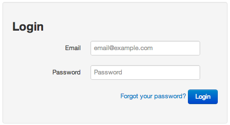
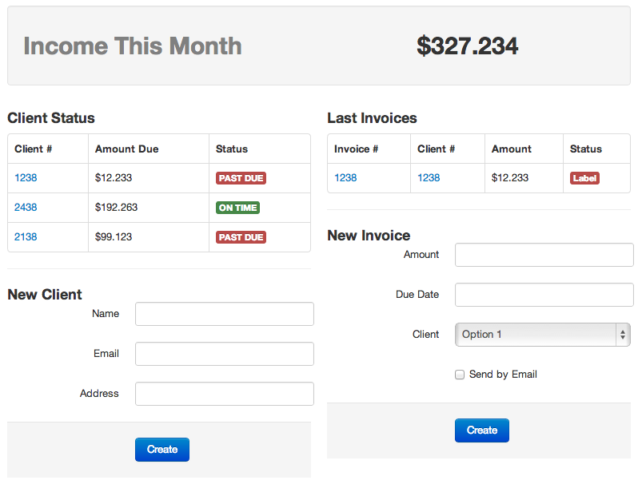

# Resultados

\label{sections:results}

## Producto Final

***Explicar qué se logró, qué puede hacer***

La herramienta que se logró en este trabajo permite desarrollar aplicaciones web completas en un navegador. Desde la creación del proyecto hasta la edición y ejecución de la aplicación, la solución es una IDE completa. Se logró incluir suficiente funcionalidad como para considerarse la solución buscada. 

El componente más importante de Switch, el editor de interfaces, logra asemejarse bastante a lo que se puede encontrar en herramientas similares, como Xcode u otras de las mencionadas en la Sección \ref{section:state-of-the-art}. Es un editor de uso intuitivo y con una gran cantidad de componentes presentes en Twitter Bootstrap, lo que permite prototipar interfaces rápida y fácilmente.

Aun cuando el editor es de fácil uso, sigue estando apuntado a usuarios expertos (desarrolladores específicamente), y no a diseñadores u otras personas que deseen prototipar interfaces solamente. Por esto mismo es que el editor provee un modo de edición de HTML, para que el desarrollador pueda realizar cambios más "finos" en los templates que edite, además de tener la posibilidad de agregar más componentes que no estarían presentes en el listado.

Además, está la posibilidad de ensamblar y probar el proyecto desde la misma IDE. El desarrollador puede simplemente presionar "Build & Run" o usar el atajo de teclado `CMD+R` (`CTRL+R` en Windows y Linux) para que el programa ensamble y levante el servidor con el proyecto.

## Modo de Uso de la Herramienta

***Escribir acá un pequeño manual de cómo usar Switch***

### Cómo Crear un Proyecto

### Cómo Crear y Editar Archivos

### Cómo Editar Vistas

### Cómo Correr el Proyecto

## Criterios de Evaluación

La idea original de este proyecto era facilitar la creación de interfaces y ahorrar el tiempo que se invierte en su creación. La evaluación de la herramienta se basará en esto. Se crearán distintas interfaces, como formularios, tablas o paneles de información, y se medirá cuánto tiempo se requiere para crear tales interfaces usando Switch y codificándolas directamente.

Esto permitirá medir diferentes factores que influyen. Por un lado, la facilidad que entrega el "arrastrar y soltar" de componentes, y, por otro lado, qué tanto influye la memoria del desarrollador al momento de codificar interfaces (considerando que se usa Twitter Bootstrap).

Es importante mencionar que al momento de utilizar Switch para crear las interfaces, también se podrá utilizar el editor de HTML (pues el poder utilizar este editor además del editor visual es considerado una característica), mientras que al crearlas con HTML sólo se podrá utilizar un editor de texto, y no el editor visual.

Los ejemplos de uso que se usarán para la medición serán los siguientes:

- Un formulario de ingreso
- Una tabla de usuarios
- Un panel de información que consista de varias tablas

## Resultado de la Evaluación

Para el primer caso, el formulario de ingreso se logró lo que se muestra en la Figura \ref{figures:login-form}. El tiempo que se requirió para construir este modelo fue de aproximadamente **3 minutos**. Construir lo mismo manualmente tomó aproximadamente **5 minutos**.

Para el segundo caso, se logró construir la tabla que se muestra en la Figura \ref{figures:table-switch}. Utilizando Switch, se pudo construir la tabla en tan sólo **2.5 minutos**, mientras que construirla sólo con código tomó **3.5 minutos**.

La idea del panel de información es que contenga varias tablas con diferentes tipos de información y formularios varios. Construir el panel usando Switch tomó aproximadamente unos **9 minutos**, mientras que manualmente tomó **14 minutos**. El resultado se puede apreciar en la Figura \ref{figures:dashboard}.

En el Cuadro \ref{table:times} se resumen los tiempos invertidos en la construcción de cada una de las interfaces.

+------------------------+-------------------+--------------------+
| Caso de Ejemplo        | Tiempo con Switch | Tiempo Manualmente |
+========================+===================+====================+
| Formulario de Ingreso  | 3 minutos         | 5 minutos          |
+------------------------+-------------------+--------------------+
| Tabla de Usuarios      | 2.5 minutos       | 3.5 minutos        |
+------------------------+-------------------+--------------------+
| Panel de Información   | 9 minutos         | 14 minutos         |
+------------------------+-------------------+--------------------+

: Resumen de tiempos en la creación de diferentes ejemplos \label{table:times}

Puede verse que hay un ahorro considerable de tiempo en varias de las interfaces, y, obviamente, mientras más complejo sea lo que se quiere construir, más tiempo es el que se ahorra.

Cabe mencionar, que al construir las interfaces manualmente, el autor tiene práctica al construir interfaces con Twitter Bootstrap, por lo que podría darse que en casos reales el ahorro sea mayor aún.