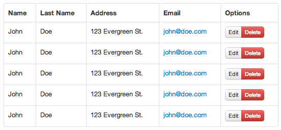

# Resultados

\label{sections:results}

## Producto Final

***Explicar qué se logró, qué puede hacer***

La herramienta que se logró en este trabajo permite desarrollar aplicaciones web completas en un navegador. Desde la creación del proyecto hasta la edición y ejecución de la aplicación, la solución es una IDE completa. Se logró incluir suficiente funcionalidad como para considerarse la solución buscada. 

El componente más importante de Switch, el editor de interfaces, logra asemejarse bastante a lo que se puede encontrar en herramientas similares, como Xcode u otras de las mencionadas en la Sección \ref{section:state-of-the-art}. Es un editor de uso intuitivo y con una gran cantidad de componentes presentes en Twitter Bootstrap, lo que permite prototipar interfaces rápida y fácilmente.

Aun cuando el editor es de fácil uso, sigue estando apuntado a usuarios expertos (desarrolladores específicamente), y no a diseñadores u otras personas que deseen prototipar interfaces solamente. Por esto mismo es que el editor provee un modo de edición de HTML, para que el desarrollador pueda realizar cambios más "finos" en los templates que edite, además de tener la posibilidad de agregar más componentes que no estarían presentes en el listado.

Además, está la posibilidad de ensamblar y probar el proyecto desde la misma IDE. El desarrollador puede simplemente presionar "Build & Run" o usar el atajo de teclado `CMD+R` (`CTRL+R` en Windows y Linux) para que el programa ensamble y levante el servidor con el proyecto.

## Modo de Uso de la Herramienta

En esta sección se describirá cómo utilizar la herramienta. Es importante mencionar que la solución propuesta está pensada para usuarios que ya tengan conocimientos para programar en Backbone, por lo que no se explicará cómo desarrollar con este framework.

### Creación y Selección de Proyectos

Al ingresar por primera vez, al desarrollador se le presenta la ventana de selección de proyectos. En ella, se mostrarán los proyectos existentes y un pequeño formulario que le permitirá crear un proyecto nuevo.

Para abrir un proyecto existente, basta con clickear en uno de ellos (número 1 de la Figura \ref{figures:tutorial-projects}). Si el usuario deseara crear un proyecto nuevo, puede escribir el nombre de éste en el formulario de abajo y presionar "Create" (número 2 de la Figura \ref{figures:tutorial-projects}).

En ambos casos, se abrirá el proyecto y el usuario será presentado con la vista principal de la aplicación.

### Manejo de Archivos y Carpetas

El usuario puede realizar acciones básicas sobre los archivos. Para crear un archivo nuevo, basta con hacer click secundario sobre el directorio donde se desee crear uno y seleccionar "New File" (ver Figura \ref{figures:tutorial-new-file}). Se mostrará una ventana modal en donde el usuario podrá escribir el nombre del archivo nuevo, como se puede ver en la Figura \ref{figures:tutorial-new-file-prompt}. En caso de que el usuario escoja un nombre que se encuentre en uso, el sistema le alertará correspondientemente.

El procedimiento es casi idéntico para la creación de directorios, con la única diferencia de que el usuario deberá escoger "New Folder" desde el menú contextual que se muestra en la Figura \ref{figures:tutorial-new-file}.

Para renombrar archivos y directorios, se debe hacer click derecho sobre éste y presionar "Rename". El nombre del archivo se convertirá en un campo de texto donde el usuario podrá escribir el nombre nuevo. Para finalizar el renombrado bastará con presionar la tecla ENTER. En la Figura \ref{figures:tutorial-rename} puede verse el campo de texto que aparece al renombrar un directorio.

Para eliminar archivos y directorios, debe seleccionarse la opción "Delete" del menú contextual. Se presenta una confirmación, especificando qué archivo o carpeta se eliminará, como se ve en la Figura \ref{figures:tutorial-confirm}.

### Edición de Archivos

Para abrir un archivo, se debe hacer click en él. Se cargará el editor de código a la derecha, mostrando los contenidos de éste. Ahí, el usuario puede hacer los cambios que sean necesarios. En la Figura \ref{figures:tutorial-code} puede verse el editor de código al abrir un archivo.

Para guardar los cambios, el usuario puede presionar `CTRL+S` en el teclado. Una vez que el archivo se haya guardado correctamente, se verá un mensaje arriba a la derecha, en la barra de navegación (ver Figura \ref{figures:tutorial-message}).

En caso de que el usuario abriera otro archivo sin antes haber guardado los cambios, el sistema automáticamente guardará los cambios por él antes de cambiar al siguiente archivo.

### Edición de Templates

Cuando el usuario hace click en un template (archivos denotados con un ícono específico en el explorador de archivos, ver Figura \ref{figures:tutorial-template-icon}), se carga el editor de interfaces en vez del editor de código simple.

El editor de interfaces muestra el contenido del template en vivo, y permite al usuario arrastrar widgets de la barra lateral derecha hacia el canvas. Por ejemplo, en la Figura \ref{figures:tutorial-drag}, puede verse cómo se arrastra un componente llamado "Prepended Input" a un formulario de registro en el canvas.

También es posible editar el HTML que se va generando con el editor. Por ejemplo, en caso de que el desarrollador desee agregar un atributo de clase o un identificador, puede hacerlo usando el editor de HTML. Para acceder a él, es posible presionar las teclas `CTRL+ALT+FLECHA ARRIBA` o bien utilizar las pestañas presentes arriba del canvas (ver Figura \ref{figures:tutorial-html}).

### Ejecutar el Proyecto

La ejecución del proyecto consiste en ensamblarlo y ejecutarlo. Existen varias formas de hacer esto. Si se desea ensamblar y ejecutar el proyecto de una vez, puede presionarse `CTRL+R` en el teclado o bien presionar el botón "Build & Run" en la esquina superior derecha. En ambos casos, se mostrará el progreso en la misma esquina, como puede verse en la Figura \ref{figures:tutorial-build}.

En caso de necesitar sólamente ensamblar o ejecutar (de forma independiente), es posible, clickeando la flecha al costado del botón "Build & Run". Esto mostrará un menú contextual con ambas opciones, como se ve en la Figura \ref{figures:tutorial-contextual}.

En caso de que el ensamblado falle, se mostrará una ventana con el detalle del error, como se puede ver en la Figura \ref{figures:tutorial-error}.

### Archivado del Proyecto

Una vez que el proyecto se encuentre finalizado o listo para ser subido a un servidor, se deberá "archivar". Esta opción ensambla el proyecto, con la diferencia de además minificar los archivos Javascript y CSS generados, efectivamente optimizándolos para producción. Al presionar esta opción, que puede verse en la Figura \ref{figures:tutorial-contextual}, el servidor ensambla y comprime el proyecto en un archivo ZIP, que luego comienza a descargarse.

### Otras Características

Existen algunas características extra disponibles para el desarrollador, que no se discutieron en detalle  en el proceso de construcción.

El usuario tiene la posibilidad de reordenar la lista de archivos abiertos, simplemente arrastrándolos. Esta característica se une a los atajos de teclado que permiten cambiar entre archivos abiertos, presionando las teclas `CTRL+NÚMERO` donde `NÚMERO` es un número entre 1 y 9.

Además, para cerrar un archivo, es posible presionar `CTRL+W`.

<!--
## Criterios de Evaluación

La idea original de este proyecto era facilitar la creación de interfaces y ahorrar el tiempo que se invierte en su creación. La evaluación de la herramienta se basará en esto. Se crearán distintas interfaces, como formularios, tablas o paneles de información, y se medirá cuánto tiempo se requiere para crear tales interfaces usando Switch y codificándolas directamente.

Esto permitirá medir diferentes factores que influyen. Por un lado, la facilidad que entrega el "arrastrar y soltar" de componentes, y, por otro lado, qué tanto influye la memoria del desarrollador al momento de codificar interfaces (considerando que se usa Twitter Bootstrap).

Es importante mencionar que al momento de utilizar Switch para crear las interfaces, también se podrá utilizar el editor de HTML (pues el poder utilizar este editor además del editor visual es considerado una característica), mientras que al crearlas con HTML sólo se podrá utilizar un editor de texto, y no el editor visual.

Los ejemplos de uso que se usarán para la medición serán los siguientes:

- Un formulario de ingreso
- Una tabla de usuarios
- Un panel de información que consista de varias tablas

## Resultado de la Evaluación

Para el primer caso, el formulario de ingreso se logró lo que se muestra en la Figura \ref{figures:login-form}. El tiempo que se requirió para construir este modelo fue de aproximadamente **3 minutos**. Construir lo mismo manualmente tomó aproximadamente **5 minutos**.

Para el segundo caso, se logró construir la tabla que se muestra en la Figura \ref{figures:table-switch}. Utilizando Switch, se pudo construir la tabla en tan sólo **2.5 minutos**, mientras que construirla sólo con código tomó **3.5 minutos**.

La idea del panel de información es que contenga varias tablas con diferentes tipos de información y formularios varios. Construir el panel usando Switch tomó aproximadamente unos **9 minutos**, mientras que manualmente tomó **14 minutos**. El resultado se puede apreciar en la Figura \ref{figures:dashboard}.

En el Cuadro \ref{table:times} se resumen los tiempos invertidos en la construcción de cada una de las interfaces.

+------------------------+-------------------+--------------------+
| Caso de Ejemplo        | Tiempo con Switch | Tiempo Manualmente |
+========================+===================+====================+
| Formulario de Ingreso  | 3 minutos         | 5 minutos          |
+------------------------+-------------------+--------------------+
| Tabla de Usuarios      | 2.5 minutos       | 3.5 minutos        |
+------------------------+-------------------+--------------------+
| Panel de Información   | 9 minutos         | 14 minutos         |
+------------------------+-------------------+--------------------+

: Resumen de tiempos en la creación de diferentes ejemplos \label{table:times}

Puede verse que hay un ahorro considerable de tiempo en varias de las interfaces, y, obviamente, mientras más complejo sea lo que se quiere construir, más tiempo es el que se ahorra.

Cabe mencionar, que al construir las interfaces manualmente, el autor tiene práctica al construir interfaces con Twitter Bootstrap, por lo que podría darse que en casos reales el ahorro sea mayor aún.
-->